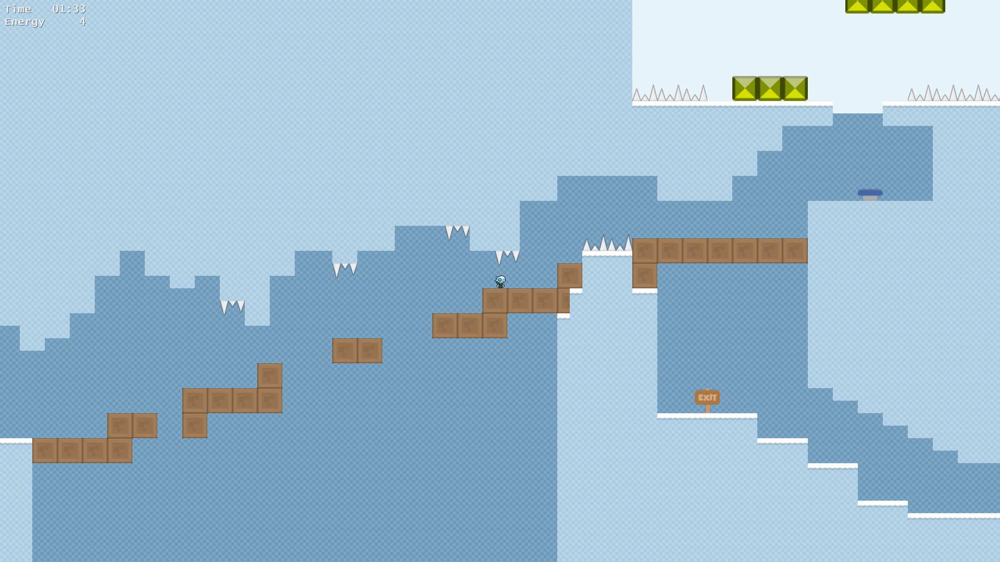

### Unnamed Platformer  
A 2D platform game with a built-in level editor.  
Programmed in Java with LWJGL and Swing.

### Features
- Ability to create, edit, and save levels
- Variable jump height
- Breakable boxes
- Springs
- Bounce blocks
- Hazards (spikes, magma)
- Water (slow region)
- Electric field (fast region)
- Windowed/fullscreen
- In-game control configuration

### Technical Info
- Large levels with many objects stay fast by using iterative spatial hashing
- Saved levels are stored as a serialized list of game objects with various properties (object type, texture, start location, size)

### Plans
- Add more gameplay mechanics
- Improve UI appearance and functionality

### Misc
Graphics and sound are all CC0-licensed. Most are from opengameart.org. 
License information for library dependencies can be found in /docs/licenses/

### Build Instructions
Although these instructions are most specifically for Eclipse, many of them may be similar for other build environments.

- Import the unnamed-platformer base directory as an existing project.
- Run the project. Make a new run configuration starting from /src/unnamed_platformer/app/Main.java.
- Export to a Runnable JAR file with the run configuration you just created.
- Copy directories /native-lib/ and /res/ to the directory where you placed the exported jar file.
- Run the jar file.

